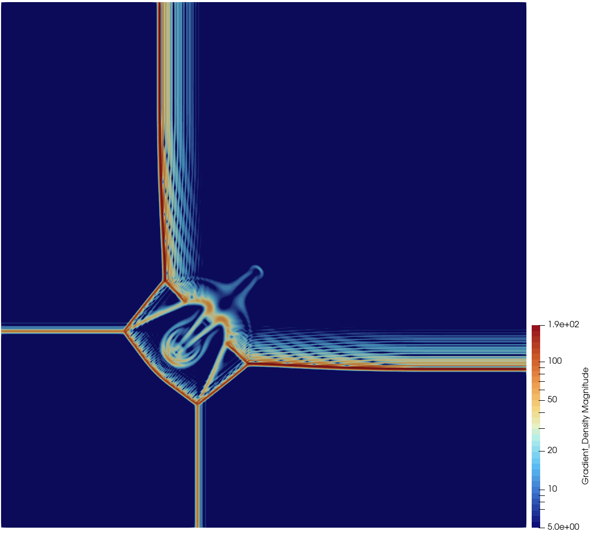
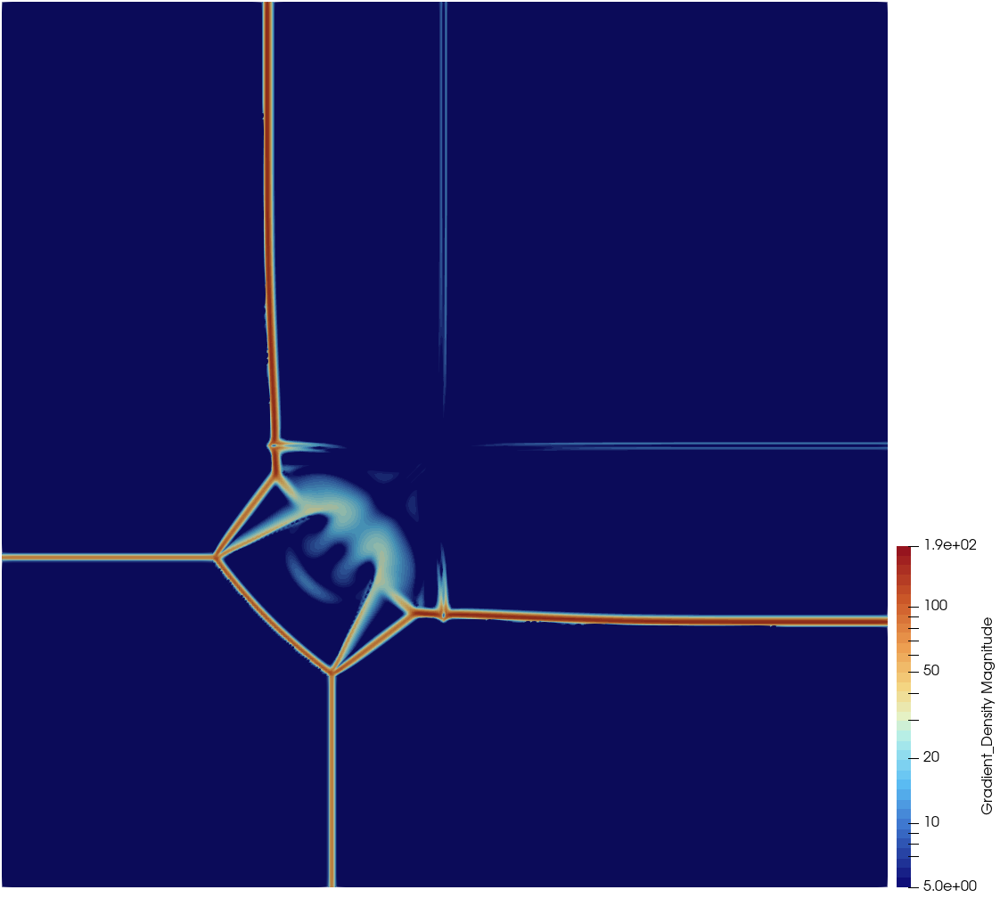
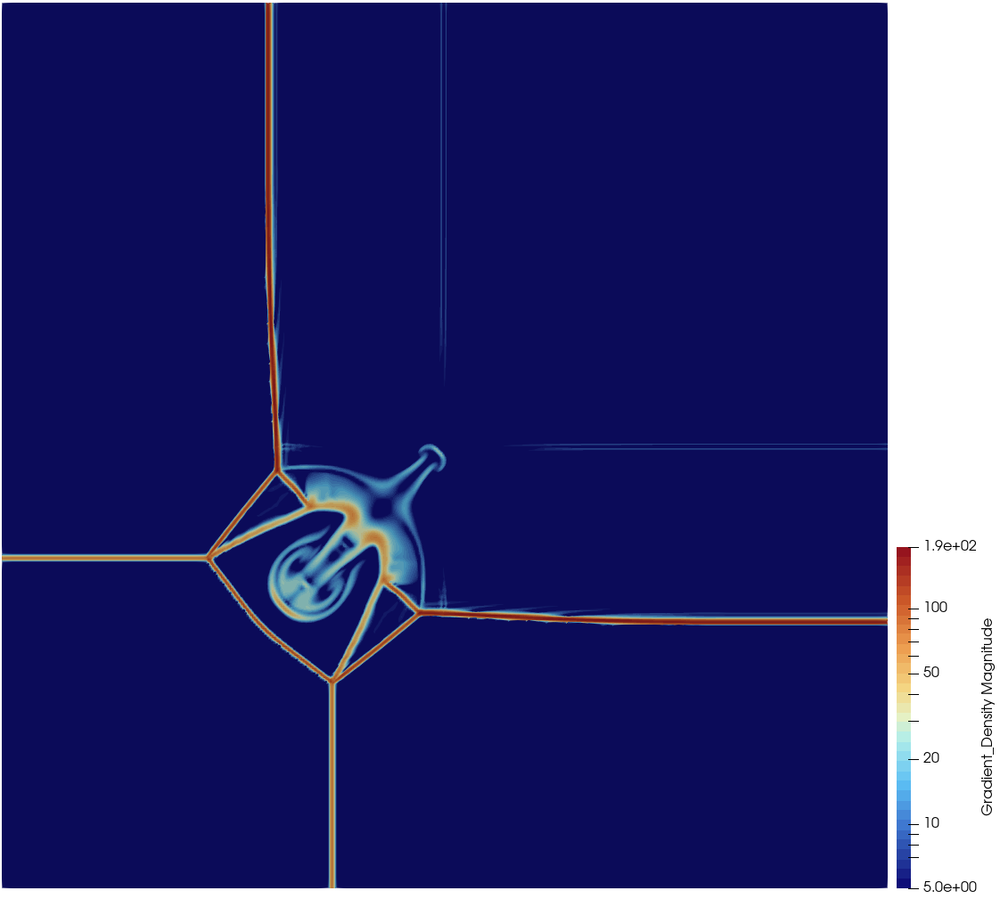

# CTurboBFM #
C++ CFD solver (translation of python based TurboBFM to C++).

### What is this repository for? ###

* Resolution of inviscid fluid dynamics problems (2D, Axisymmetric and 3D)
* Simulation of turbomachinery flows through the concept of body force models

### How do I get set up? ###

* wait for build docs

### Results Example ###

##### Schulz benchmark test case 3 #####
Test case number 3 for shock-capturing properties of numerical scheme, taken from Schulz Riemann problems.
The following pictures shows the difference between JST, Roe, and Roe with 2nd order reconstruction and Van Leer flux limiter:

### Notes ###
* The code has been written for Mac OS systems, so there is the chance for some path-related commands to not run correctly
on windows based machines. It should be quite easy to fix.

* The system of Euler equations is solved with explicit methods (3rd or 4th order Runge-Kutta). This means that the time-step must be accurately restricted below certain limits, and a large number of iterations may be required to simulate a certain problem. The first thing to do when a simulation fails, is to try reducing the `CFL_MAX` input parameter. 

### Contribution guidelines ###

* Validate the modifications by means of detailed test cases (use google gtest)

### Authors and contacts ###

- **Francesco Neri**, TU Delft, `f.neri@tudelft.nl`